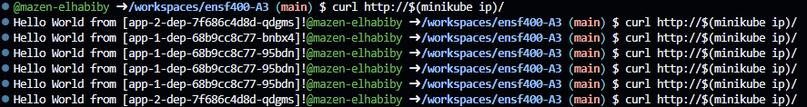
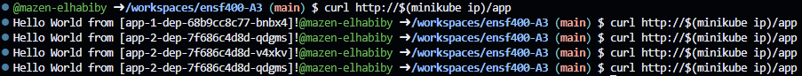

# ENSF 400 Mazen El Habiby's Assignment 3

Start Minikube

```bash
minikube start
```


Enabling necessary addons:

```bash
minikube addons enable ingress
```

Pulling the required Docker images:

```bash
docker pull ghcr.io/denoslab/ensf400-sample-app:v1
```

```bash
docker pull ghcr.io/denoslab/ensf400-sample-app:v2
```

Applying all the Kubernetes configuration files in your assignment3/ directory:

```bash
kubectl apply -f assignment3/
```

## Testing/Output

Testing Load Balancer

```bash
curl http://$(minikube ip)/
```
Output:


Testing Direct App Acess
```bash
curl http://$(minikube ip)/app
```
Output:


## Cleanup

Deleting All Ressources:
```bash
kubectl delete -f assignment3/
```

Stopping MiniKube
```bash
minikube stop
```

Delete MiniKube
```bash
minikube delete
```


